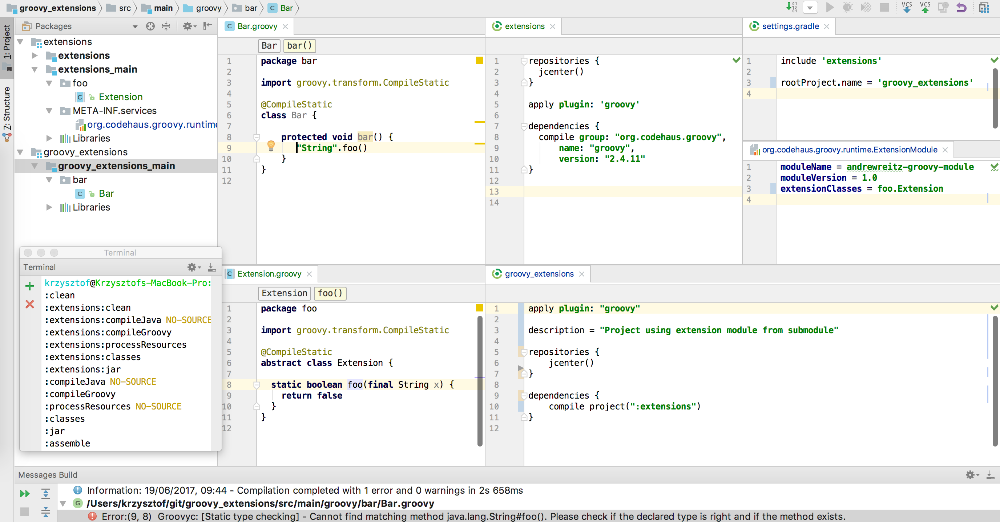

# IntelliJ Idea error with Groovy Extension Module and CompileStatic

When one define [extension module](http://groovy-lang.org/metaprogramming.html#_extension_modules), ide understand it and show extensions, 
but when compiling, compilation fails, even though it works in Gradle. 

